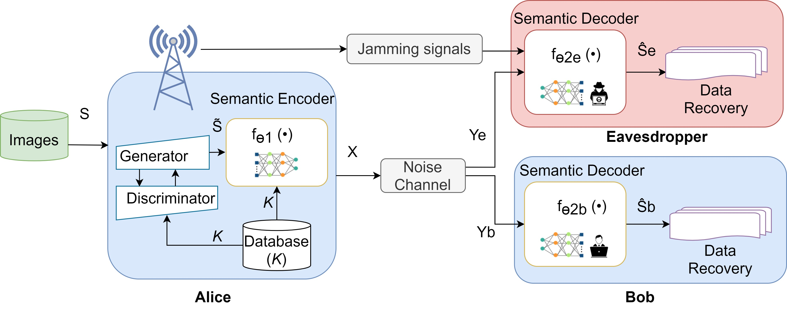

# Security Improvement for Deep Learning-based Semantic Communication Systems

The core objective of this project is to develop a security solution against eavesdropping while keeping the integrity of the system and ensuring that robust semantic features remain accessible to legitimate users. 
The approach entails two key components: jamming signal transmission and noise injection. 
By strategically disrupting the signal that eavesdroppers get, this method not only counters the eavesdropper's attempt but also maintains the communication data for authorized users. 
Furthermore, a noise factor is used for the intercepted signal, rendering it incomprehensible to unauthorized parties.

The considered system model:



## Prerequisites

To run this project, you need to have the following libraries installed in your Python 3.8.0 environment:

1. **PyTorch 1.13.1** with CUDA toolkit 12.2

2. **Torchvision 0.17.1**

3. **Numpy 1.24.4**

4. **SciPy 1.10.1**

5. **Visdom 0.2.4**

6. **PyTorch Metrics SSIM**

7. **Dominate 2.8.0**


``` python
!pip install python==3.9.0
!pip install numpy==1.24.4
!pip install pytorch==1.13.1 cudatoolkit==12.2 -c pytorch
!pip install torchvision==0.17.1
!pip install scipy==1.10.1
!pip install visdom==0.2.4
!pip install pytorch_msssim
!pip install dominate==2.8.0
```

# Training process

Change the folder between 'Bob' and 'Eve' to train their models
All available options are under options folder. 

**One example for training:**
``` python
cd Bob && python train.py --gpu_ids '0' --feedforward 'EXPLICIT-RES' --N_pilot 2 --n_downsample 2 --C_channel 12 --S 6 --SNR 0 --dataset_mode 'CIFAR10' --n_epochs 100 --n_epochs_decay 100 --lr 1e-3 
```

# Testing process
Change the folder between 'Bob' and 'Eve' to test their models

**One example for testing:**
``` python
cd Bob && python test.py --gpu_ids '0' --feedforward 'EXPLICIT-RES' --N_pilot 2 --n_downsample 2 --C_channel 12 --S 6 --SNR 0 --dataset_mode 'CIFAR10' --output_path './results/' --aspect_ratio 1.0 --phase 'test' --num_test 10000 --how_many_channel 5
```
